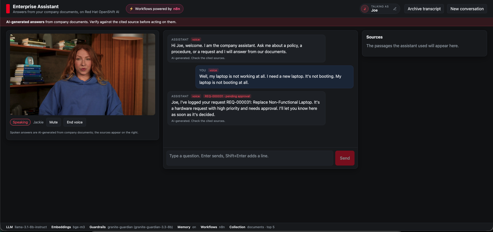
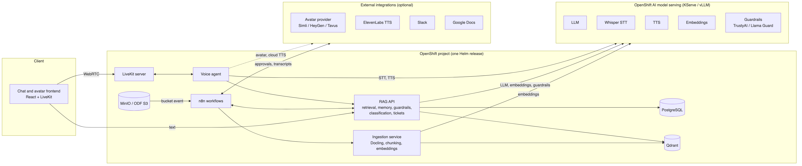

# Deploy an enterprise voice and avatar assistant on OpenShift AI

Ground a voice-enabled, avatar-fronted assistant in your company documents with RAG, n8n workflows, and models served on Red Hat OpenShift AI.

> **Status: work in progress.** This README describes the target design. Components are being added incrementally; see [Repository structure](#repository-structure) for what exists today.

## Table of Contents

- [Overview](#overview)
- [Detailed description](#detailed-description)
  - [See it in action](#see-it-in-action)
  - [Architecture diagrams](#architecture-diagrams)
- [Requirements](#requirements)
  - [Minimum hardware requirements](#minimum-hardware-requirements)
  - [Minimum software requirements](#minimum-software-requirements)
  - [Required user permissions](#required-user-permissions)
- [Deploy](#deploy)
  - [Prerequisites](#prerequisites)
  - [Installation](#installation)
  - [Validating the deployment](#validating-the-deployment)
  - [Delete](#delete)
- [Demo walkthrough](#demo-walkthrough)
- [Repository structure](#repository-structure)
- [References](#references)
- [Technical details](#technical-details)
- [Tags](#tags)

## Overview

Employees lose time hunting through policies and procedures, and service desks spend hours on requests that follow the same intake, approval and fulfillment pattern. This quickstart deploys a virtual assistant that answers questions from your own documents with citations, speaks through a lip-synced avatar, and turns spoken requests into tracked tickets approved in Slack. It is for platform and AI teams that need a sovereign assistant: the models, the data and the workflows all run on Red Hat OpenShift AI in your own cluster. After deploying, you upload documents, ask questions by text or voice, drop in an invoice for field extraction, and file a service request end to end.

## Detailed description

Knowledge in most organizations is scattered across PDFs, Word documents, wikis and ticketing systems. Chat assistants built on public APIs can answer questions, but they send sensitive content off-platform, cannot show where an answer came from, and rarely close the loop on what follows a question, such as approving a request or updating a ticket. Voice and avatar interfaces make assistants approachable for frontline staff, kiosks and accessibility use cases, but real-time speech is hard to run privately.

This quickstart shows how Example Corp, a fictional company, runs an assistant that answers from its own policy and procedure documents with source citations, remembers the conversation across text and voice, and lets people interrupt the avatar mid-sentence. Incoming documents such as invoices and contracts are classified and their fields extracted before being routed to Slack or a downstream system. Service requests made by chat or voice are classified, sent to Slack for approval, fulfilled and tracked, and the assistant tells the requester the outcome. Transcripts are archived to Google Docs and re-indexed, so the assistant can answer questions about earlier conversations. Typical scenarios are IT and HR help desks, procurement intake, and front-desk or kiosk assistants in regulated industries where data must not leave the organization.

After deployment you can:

- Upload documents and watch them parsed, indexed and confirmed in Slack
- Ask questions by text or voice and see the passages each answer is based on
- Interrupt the avatar mid-sentence and ask a follow-up that needs the earlier context
- Drop an invoice into the inbox bucket and receive its type and extracted fields in Slack
- File a request by voice, approve it in Slack, and hear the assistant confirm the outcome
- Archive a conversation to Google Docs and ask about it later
- Swap the avatar provider or point the language model at a remote endpoint with one value

### See it in action



The avatar speaks the answers while the chat shows the same text with its citations; the status bar lists the models behind the session (Llama 3.1 8B, BGE-M3, Granite Guardian) served on OpenShift AI. A presenter script with timings and expected answers is in [docs/demo-script.md](docs/demo-script.md).

### Architecture diagrams



<details>
<summary>Diagram source (Mermaid)</summary>


</details>

How data moves through the system:

1. **Ingestion.** Documents land in an S3 bucket (MinIO or OpenShift Data Foundation) or Google Drive. A bucket notification triggers the n8n ingestion workflow, which calls the ingestion service. Docling parses the file, chunks are embedded with the embeddings model, and vectors with source and page metadata are upserted into Qdrant.
2. **Text question.** The frontend calls the RAG API. The API checks input guardrails, retrieves the top chunks from Qdrant, loads recent history from PostgreSQL, calls the LLM, checks output guardrails, stores the exchange, and returns an answer with citations.
3. **Voice question.** The browser connects over WebRTC to the LiveKit server. The voice agent transcribes speech with Whisper, calls the same RAG API, synthesizes the reply with the TTS model, and hands audio to the avatar provider, which publishes lip-synced video back into the room.
4. **Service requests.** When a chat or voice message is a request rather than a question, the RAG API classifies it, opens a ticket in PostgreSQL, and hands it to the n8n approval workflow. The decision made in Slack is written back to the ticket and pushed into the same conversation as a notice, which the avatar speaks and the chat shows.
5. **Workflows.** Classification, request intake, Slack approvals, and transcript archival run as n8n workflows that call the RAG API and the Slack and Google Docs integrations.

## Requirements

### Minimum hardware requirements

Application components, per replica, using the chart defaults:

| Component | CPU request / limit | Memory request / limit | Storage |
|---|---|---|---|
| Frontend | 100m / 500m | 128 MiB / 256 MiB | none |
| RAG API | 500m / 2 vCPU | 1 GiB / 2 GiB | none |
| Ingestion service | 1 vCPU / 4 vCPU | 2 GiB / 8 GiB | none |
| Voice agent | 500m / 2 vCPU | 1 GiB / 2 GiB | none |
| LiveKit server | 500m / 2 vCPU | 512 MiB / 2 GiB | none |
| n8n | 250m / 1 vCPU | 512 MiB / 1 GiB | 8 GiB PVC |
| PostgreSQL | 250m / 1 vCPU | 512 MiB / 1 GiB | 10 GiB PVC |
| Qdrant | 250m / 1 vCPU | 512 MiB / 2 GiB | 10 GiB PVC |
| MinIO | 250m / 1 vCPU | 512 MiB / 1 GiB | 20 GiB PVC |

Models served on OpenShift AI, only if you deploy them with the chart instead of pointing at existing endpoints:

| Model | Example | GPU | CPU / Memory |
|---|---|---|---|
| LLM | Llama 3.1 8B Instruct on vLLM | 1 NVIDIA GPU with 24 GiB or more (L4, A10G, L40S, A100) | 4 vCPU / 16 GiB |
| Speech-to-text | Whisper large-v3-turbo on vLLM | 1 NVIDIA GPU with 16 GiB or more, or shared with the LLM | 2 vCPU / 8 GiB |
| Text-to-speech | Kokoro or Orpheus | Optional. CPU is sufficient for demo load | 2 vCPU / 4 GiB |
| Embeddings | BGE-M3 on vLLM | 1 NVIDIA GPU with 16 GiB or more (the chart default), or a CPU or remote endpoint for light load | 2 vCPU / 8 GiB |
| Guardrails | Granite Guardian 3.3 8B on vLLM | 1 NVIDIA GPU with 24 GiB or more | 4 vCPU / 16 GiB |

> **Note:** If all models are hosted remotely, on OpenShift AI in another project or at a Models-as-a-Service provider, this quickstart needs no GPU in the cluster.

### Minimum software requirements

- Red Hat OpenShift 4.16 or later
- Red Hat OpenShift AI 3.5 or later with KServe in standard deployment mode and the vLLM ServingRuntime enabled
- NVIDIA GPU Operator and Node Feature Discovery Operator, only if deploying GPU models with the chart
- A default StorageClass that supports ReadWriteOnce volumes
- Client tools: `oc` 4.16 or later and `helm` 3.14 or later
- Optional: the OpenShift GitOps operator (Argo CD) for the GitOps deployment path
- Optional: the TrustyAI component of OpenShift AI, only for the `trustyai` guardrails provider. The default provider, Granite Guardian on vLLM, does not need it
- Optional external services: a Slack workspace with a bot token, a Google Cloud project with the Docs and Drive APIs enabled, an avatar provider account (Tavus, Simli, or Hedra), and ElevenLabs. See [Third-party accounts and keys](#third-party-accounts-and-keys)

Tested with (September 2026, single node with 4x NVIDIA L4):

| Component | Version |
|---|---|
| Red Hat OpenShift | 4.20.35 |
| Red Hat OpenShift AI | 3.5.0, KServe standard deployment mode |
| NVIDIA GPU Operator | 25.3.4 (also verified by a contributor with 26.3.3) |
| Node Feature Discovery Operator | 4.20.0 |
| NVIDIA driver / CUDA | 580.82.07 / 13.0 on NVIDIA L4 (from the GPU operator) |
| vLLM runtime image | `registry.redhat.io/rhaii/vllm-cuda-rhel9` (vLLM 0.24.0, CUDA 13.0), pinned by digest in `chart/values.yaml` |
| OpenShift GitOps (optional) | 1.21.4 |
| cert-manager operator (optional, trusted ingress certificate) | 1.20.0 |
| n8n | 2.37.11 |
| LiveKit server | 1.13.6 |
| PostgreSQL / Qdrant / MinIO | 16 / 1.19.1 / RELEASE.2025-07-23 |
| Kokoro TTS (kokoro-fastapi) | 0.8.2 |
| Helm client | 3.14 or later (tested with 3.17 and 4.2) |

Read the driver and CUDA versions of your own GPU nodes from the labels set by the GPU operator: `oc get nodes -L nvidia.com/cuda.driver-version.full,nvidia.com/cuda.runtime-version.full`.

### Required user permissions

This quickstart deploys as a regular OpenShift user with:

- Permission to create a project, or an existing project where you are an admin
- Permission to create Deployments, StatefulSets, Services, Routes, PersistentVolumeClaims, Secrets, and ConfigMaps in that project
- Permission to create InferenceServices and ServingRuntimes in that project, only if deploying models with the chart

No cluster admin access is required. Two caveats:

- PostgreSQL, Qdrant, MinIO, and n8n are deployed by the chart itself rather than by cluster-wide operators, so no operator installation is needed.
- The LiveKit server must expose WebRTC media to browsers. On OpenShift this is done with LiveKit's built-in TURN server over TLS behind a passthrough Route, which needs a certificate the browser trusts. See `livekit.turn` in the values file.

Cluster administrators who start from a bare cluster can install the platform prerequisites with the manifests in [deploy/bootstrap/](deploy/bootstrap/README.md).

### Third-party accounts and keys

Everything below is optional; the assistant runs without any of it. Keys go into the `assistant-integrations` secret (created by `scripts/create-secrets.sh` from environment variables, or updated later with `oc set data secret/assistant-integrations -n ${PROJECT} KEY=value`), never into git.

**Tavus (avatar video).** Sign up at [platform.tavus.io](https://platform.tavus.io) and create an API key under the developer settings; put it in the secret as `TAVUS_API_KEY`. Pick a stock face in the [face library](https://maker.tavus.io/dev/faces); its ID starts with `r` and is not secret, so set it in values as `voiceAgent.extraEnv.TAVUS_FACE_ID` next to `voiceAgent.avatarProvider: tavus`. The free plan includes 25 conversational minutes per month and one concurrent stream, so rehearse with `avatarProvider: none` and switch Tavus on for the avatar runs. The provider receives only the assistant's synthesized speech; the microphone audio stays in the cluster.

**Slack (notifications and approvals).** Create an app from `n8n/slack-app-manifest.json` at [api.slack.com/apps](https://api.slack.com/apps) (*Create New App*, *From a manifest*). Under *OAuth & Permissions* install it to the workspace and copy the *Bot User OAuth Token* (`xoxb-…`) into the secret as `SLACK_BOT_TOKEN`; n8n creates its Slack credential from it on first start. Under *Interactivity & Shortcuts* set the request URL to `https://<n8n host>/webhook/slack-interactions` and keep Socket Mode off. Create the channels `#assistant-ingestion`, `#assistant-documents`, `#assistant-approvals`, `#assistant-tickets`, and `#assistant-knowledge-gaps`, and invite the app to each.

**Google Docs (transcript archival).** In [Google Cloud console](https://console.cloud.google.com) create a project, enable the *Google Docs API* and *Google Drive API*, configure the OAuth consent screen as *External* and add yourself as a test user, then create an *OAuth client ID* of type *Web application* whose authorized redirect URI is `https://<n8n host>/rest/oauth2-credential/callback`. In n8n add a *Google Docs OAuth2 API* credential with the client ID and secret and sign in. Create a Drive folder for transcripts and set its ID (the part of the URL after `/folders/`) in values as `n8n.extraEnv.GOOGLE_DOCS_FOLDER_ID`. While the consent screen stays in *Testing*, Google expires the sign-in after seven days; publishing the app removes that limit.

**ElevenLabs (cloud text-to-speech, instead of Kokoro).** Create an API key at [elevenlabs.io](https://elevenlabs.io) and put it in the secret as `ELEVENLABS_API_KEY`; choose a voice ID from their voice library and set `voiceAgent.extraEnv.TTS_PROVIDER: elevenlabs` and `voiceAgent.extraEnv.ELEVENLABS_VOICE_ID: <id>`.

**Simli and Hedra (alternative avatar providers).** Same pattern as Tavus with `SIMLI_API_KEY` and `SIMLI_FACE_ID`, or `HEDRA_API_KEY` and `HEDRA_AVATAR_IMAGE`, and the matching `voiceAgent.avatarProvider`.

## Deploy

### Prerequisites

Before deploying, ensure you have:

- Access to an OpenShift cluster with OpenShift AI installed that meets the requirements above
- `oc` installed and logged in (`oc whoami` returns your user)
- `helm` installed
- Run `scripts/check-prereqs.sh` after logging in; it reports anything missing and which permissions you lack
- Model endpoints ready: either existing OpenAI-compatible endpoints (MaaS) with API keys, or GPU capacity to deploy models with the chart
- Optional: a Slack bot token, a Google service account JSON key, an avatar provider API key, and an ElevenLabs API key

### Installation

**Quick path.** One command does steps 2 to 5 below: it detects the current project and the cluster apps domain, creates the secrets, installs the chart, waits for pods and models, and prints the URLs. Add `MODELS=maas` to be prompted for remote model endpoints, `RUN_TESTS=1` to finish with `helm test`, and pass any extra Helm arguments such as `-f my-values.yaml`.

```bash
PROJECT=${PROJECT} scripts/deploy.sh
```

The manual steps follow for when you want to see or change each one.

1. Clone the repository:

```bash
git clone https://github.com/rh-ai-quickstart/enterprise-voice-avatar-assistant.git
cd enterprise-voice-avatar-assistant
```

2. Create a new OpenShift project and note the cluster apps domain:

```bash
PROJECT="voice-avatar-assistant"
DOMAIN=$(oc get ingresses.config.openshift.io cluster -o jsonpath='{.spec.domain}')
oc new-project ${PROJECT}
```

3. Create the secrets. The script generates passwords for PostgreSQL, MinIO, n8n, and LiveKit, and stores any API keys you export beforehand (the variable names are listed in the script header). Secrets are never stored in git.

```bash
NAMESPACE=${PROJECT} scripts/create-secrets.sh
```

4. Install the chart. `global.domain` gives Routes, n8n, and LiveKit stable public URLs. Pick one of the two model options.

**Option A: deploy the models with the chart (default)**

The chart creates InferenceServices on OpenShift AI for the LLM (Llama 3.1 8B Instruct, W4A16), Whisper, and the embeddings model, plus a CPU text-to-speech service. This needs three GPUs; see [Minimum hardware requirements](#minimum-hardware-requirements).

```bash
helm install assistant chart --namespace ${PROJECT} \
  --set global.domain=${DOMAIN}
```

**Option B: bring your own model endpoints (MaaS)**

Point any model at an existing OpenAI-compatible endpoint instead. Endpoints include the protocol and the `/v1` path. API keys are read by the secrets script from `LLM_API_KEY`, `STT_API_KEY`, `EMBEDDINGS_API_KEY`, and `TTS_API_KEY`.

```bash
helm install assistant chart --namespace ${PROJECT} \
  --set global.domain=${DOMAIN} \
  --set models.llm.deploy=false \
  --set models.llm.endpoint=https://LLM_ENDPOINT/v1 \
  --set models.llm.servedModelName=LLM_MODEL_NAME \
  --set models.stt.deploy=false \
  --set models.stt.endpoint=https://STT_ENDPOINT/v1 \
  --set models.stt.servedModelName=STT_MODEL_NAME \
  --set models.embeddings.deploy=false \
  --set models.embeddings.endpoint=https://EMBEDDINGS_ENDPOINT/v1 \
  --set models.embeddings.servedModelName=EMBEDDINGS_MODEL_NAME
```

The two options mix per model, for example a MaaS LLM with Whisper deployed locally. For longer configurations copy `chart/values.yaml`, edit it, and pass it with `-f my-values.yaml`. Guardrails, the avatar provider, and the integrations are configured through the same file. Every value with its default and meaning is listed in [chart/README.md](chart/README.md).

5. The n8n workflows are imported and published automatically when n8n starts (the `n8n.workflows` values control this). If `SLACK_BOT_TOKEN` was in the integrations secret at install time, the Slack nodes are wired too; otherwise open the n8n Route, add a Slack credential, and attach it. Google Docs (transcript archival) always needs a one-time sign-in in n8n. To update workflows later, edit `chart/files/n8n-workflows/` and run `scripts/import-workflows.sh`.

```bash
echo https://$(oc get route/n8n -n ${PROJECT} --template='{{.spec.host}}')
```

#### Deploying with Argo CD (optional)

If the OpenShift GitOps operator is installed, Argo CD can own the deployment and keep it in sync with the `main` branch. It renders the same chart, so nothing differs from a manual install.

```bash
oc label namespace ${PROJECT} argocd.argoproj.io/managed-by=openshift-gitops
oc apply -f deploy/argocd/appproject.yaml
oc apply -f deploy/argocd/application.yaml
```

See [deploy/argocd/README.md](deploy/argocd/README.md) for per-cluster values files.

#### Testing model access before deploying

The chart refuses to install when a model is set to `deploy: false` without an endpoint and a served model name, and prints what to set. After the install, `helm test` checks every configured model from inside the cluster (model lists, an embeddings call, and an LLM chat completion) plus the datastores and services:

```bash
helm test assistant -n ${PROJECT} --logs
```

For Argo CD deployments there is no Helm release to test; `NS=${PROJECT} scripts/test-services.sh` renders the same test pod from the chart, runs it, and prints the results.

### Working with the generated secrets

`scripts/create-secrets.sh` creates seven Secrets in the project and never overwrites an existing one unless `FORCE=1` is set. Argo CD does not manage them, so they survive syncs.

| Secret | Keys |
|---|---|
| `assistant-postgres` | `POSTGRESQL_USER`, `POSTGRESQL_PASSWORD`, `POSTGRESQL_DATABASE`, `DATABASE_URL` |
| `assistant-minio` | `MINIO_ROOT_USER`, `MINIO_ROOT_PASSWORD` |
| `assistant-n8n` | `N8N_ENCRYPTION_KEY` |
| `assistant-qdrant` | `QDRANT_API_KEY` |
| `assistant-livekit` | `LIVEKIT_API_KEY`, `LIVEKIT_API_SECRET` |
| `assistant-models` | `LLM_API_KEY`, `STT_API_KEY`, `TTS_API_KEY`, `EMBEDDINGS_API_KEY`, `GUARDRAILS_API_KEY`, `HF_TOKEN` |
| `assistant-integrations` | `SLACK_BOT_TOKEN`, `SLACK_SIGNING_SECRET`, `TAVUS_API_KEY`, `TAVUS_FACE_ID`, `TAVUS_PAL_ID`, `SIMLI_API_KEY`, `SIMLI_FACE_ID`, `ELEVENLABS_API_KEY`, `GOOGLE_SERVICE_ACCOUNT_JSON` |

Read a value, for example the MinIO console login:

```bash
oc extract secret/assistant-minio -n ${PROJECT} --to=-
```

Add or rotate one key without touching the others, then restart the pod that reads it (the config map and secrets are read at start):

```bash
oc set data secret/assistant-integrations -n ${PROJECT} TAVUS_API_KEY=<value>
oc rollout restart deployment/voice-agent -n ${PROJECT}
```

Back up `assistant-n8n`: losing `N8N_ENCRYPTION_KEY` makes every credential stored in n8n unreadable. `FORCE=1 scripts/create-secrets.sh` regenerates all passwords and is only for a fresh install; on a running deployment it would lock the services out of PostgreSQL and MinIO.

### Validating the deployment

If something does not come up, [docs/troubleshooting.md](docs/troubleshooting.md) lists the symptoms seen while building this quickstart with the command that confirms each and the fix.

1. Check that all pods are running. Model pods can take several minutes to download weights on first start.

```bash
oc get pods -n ${PROJECT}
```

2. Get the frontend URL and open it in a browser:

```bash
echo https://$(oc get route/frontend -n ${PROJECT} --template='{{.spec.host}}')
```

3. Run the Helm test. It checks the health endpoint of every enabled service and sends one chat completion to the LLM.

```bash
helm test assistant --namespace ${PROJECT}
```

4. Load the sample documents with `NS=${PROJECT} scripts/load-sample-docs.sh`. It uploads the policies in `data/sample-docs/` to the `documents` bucket and the invoices and contracts to `inbox`; the ingestion and classification workflows in n8n run within a few seconds. You can also upload single files through the MinIO console.

```bash
echo https://$(oc get route/minio-console -n ${PROJECT} --template='{{.spec.host}}')
```

5. Ask a question about the uploaded document in the frontend. The answer should include citations pointing at the file and page.

### Delete

1. Uninstall the Helm release:

```bash
helm uninstall assistant --namespace ${PROJECT}
```

2. Remove the persistent volumes. Helm keeps them by default so data survives upgrades.

```bash
oc delete pvc -l app.kubernetes.io/instance=assistant -n ${PROJECT}
```

3. (Optional) Delete the project:

```bash
oc delete project ${PROJECT}
```

## Demo walkthrough

The demo follows one storyline, from deployment to portability. Each step builds on the previous one.

1. **Deploy the full stack** with a single `helm install` (or an Argo CD sync), then show the pods, Routes, and InferenceServices coming up.
2. **Upload company documents** to the MinIO bucket and watch the ingestion workflow run in n8n: parse, chunk, embed, index, notify.
3. **Ask a question in text.** The answer is grounded in the uploaded documents and the citations panel shows the source file and page.
4. **Ask the same question by voice.** The avatar answers with lip-synced speech. Interrupt it mid-sentence to show barge-in.
5. **Ask a follow-up question** that only makes sense with context. The assistant uses conversation memory from PostgreSQL to resolve it.
6. **Drop an invoice or contract** into the bucket. The classification workflow identifies the document type, extracts fields to JSON, and posts the result to Slack.
7. **Submit a service request by voice.** A ticket is created in PostgreSQL, an approval request appears in Slack, and after approval the avatar confirms fulfillment.
8. **Show the transcript** saved to Google Docs and re-ingested, then ask a question that the transcript answers.
9. **Open the OpenShift AI dashboard** to show the served models and their metrics, then the Qdrant and PostgreSQL data behind the demo.
10. **Swap the avatar provider or the LLM endpoint** with a values change and redeploy, demonstrating portability and data sovereignty.

A presenter script with timings, exact questions and expected answers is in [docs/demo-script.md](docs/demo-script.md).

## Repository structure

```
.
├── README.md
├── LICENSE                       # MIT
├── CONTRIBUTING.md               # How to propose changes and the checks to run
├── chart/                        # Helm chart (template layout): datastores, n8n, LiveKit,
│   ├── README.md                 #   chart reference: what it creates, every value with its default
│   ├── Chart.yaml                #   application services, and model InferenceServices
│   ├── values.yaml               # Default configuration: models, images, sizing
│   ├── values-demo-cluster.yaml  # Example per-cluster overrides, used by Argo CD
│   ├── files/n8n-workflows/      # The n8n workflows, imported by n8n on first start
│   └── templates/                # Resources, values validation, and the Helm test pod
├── deploy/
│   ├── argocd/                   # Argo CD AppProject and Application (optional GitOps path)
│   └── bootstrap/                # Admin-only operator install for bare clusters (optional)
├── scripts/
│   ├── deploy.sh                 # One-command install: secrets, chart, wait, URLs
│   ├── check-prereqs.sh          # Verifies cluster prerequisites and permissions
│   ├── create-secrets.sh         # Creates the Secrets the chart expects
│   ├── test-services.sh          # Runs the connectivity test pod (also for Argo CD installs)
│   ├── demo-preflight.sh         # Models, Argo CD status, test pod and n8n webhooks before a demo
│   ├── check-index.sh            # Indexed documents, duplicates, stale-text search
│   ├── n8n-executions.sh         # Recent n8n executions with node errors (needs an API key)
│   ├── cluster-versions.sh       # Versions behind the tested-versions table
│   ├── import-workflows.sh       # Updates the n8n workflows through the public API
│   └── load-sample-docs.sh       # Uploads the sample documents into MinIO
├── docs/
│   ├── development.md            # Running the services locally, tests, images, documents, workflows
│   ├── demo-script.md            # 15-minute presenter script with expected answers
│   ├── troubleshooting.md        # Symptoms, causes, checks and fixes from the demo cluster
│   └── images/                   # Architecture diagram and screenshots
├── n8n/                          # Workflow docs and the Slack app manifest (workflow JSON lives in chart/files/n8n-workflows/)
├── frontend/                     # React chat UI: citations, voice, avatar video
├── services/
│   ├── rag-api/                  # retrieval, memory, guardrails, classification, tickets (FastAPI)
│   ├── ingestion/                # Docling parsing, chunking, embeddings, Qdrant upsert (FastAPI)
│   └── voice-agent/              # LiveKit Agents worker (Whisper, RAG API, Kokoro, avatar providers)
├── data/sample-docs/             # Synthetic Example Corp documents (Markdown sources in src/, rendered DOCX and PDF)
└── .github/workflows/            # CI: helm lint and tests; image builds published to quay.io/rh-ai-quickstart
```

## References

- [Red Hat OpenShift AI documentation](https://docs.redhat.com/en/documentation/red_hat_openshift_ai_self-managed)
- [Serving models with vLLM on OpenShift AI](https://docs.redhat.com/en/documentation/red_hat_openshift_ai_self-managed/latest/html/serving_models/)
- [Docling](https://docling-project.github.io/docling/)
- [Qdrant](https://qdrant.tech/documentation/)
- [n8n](https://docs.n8n.io/)
- [LiveKit Agents](https://docs.livekit.io/agents/)
- [TrustyAI Guardrails](https://trustyai.org/docs/main/guardrails)
- [Llama Guard](https://www.llama.com/docs/model-cards-and-prompt-formats/llama-guard-3/)
- Related quickstarts: [basic-speech-to-text-with-whisper](https://github.com/rh-ai-quickstart/basic-speech-to-text-with-whisper), [RAG](https://github.com/rh-ai-quickstart/RAG), [guardrailing-llms](https://github.com/rh-ai-quickstart/guardrailing-llms), [it-self-service-agent](https://github.com/rh-ai-quickstart/it-self-service-agent)

## Technical details

**Model endpoints.** Every model is consumed through an OpenAI-compatible API: chat completions for the LLM and guardrails, audio transcriptions for Whisper, audio speech for TTS, and embeddings for the indexing model. Each model has a `deploy` toggle plus `endpoint` and `servedModelName` values; API keys live in the models Secret. Switching from a local InferenceService to a MaaS endpoint, or to a frontier provider as a fallback, is a values change with no code change. In-cluster endpoints that OpenShift AI serves over TLS are trusted through the OpenShift service CA, which every pod already mounts.

**RAG API.** A FastAPI service that owns retrieval, memory, guardrails, classification, and tickets so that text chat, voice, and n8n all share one grounded answer path. Main endpoints: `POST /v1/chat` (grounded answer with citations and memory), `POST /v1/search` (retrieval only), `POST /v1/classify` (document type and field extraction to JSON), `POST /v1/tickets` and `PATCH /v1/tickets/{id}` (service request state), `GET /v1/voice/token` (LiveKit room token for the browser).

**Ingestion.** Docling converts PDF, DOCX, PPTX, HTML, and images to a structured document. The hybrid chunker produces token-bounded chunks with heading context. Each Qdrant point carries `doc_id`, `source`, `page`, `chunk_index`, and `text`, which is what the citations panel displays. Re-ingesting a document with the same `doc_id` replaces its points.

**Memory and tickets.** PostgreSQL holds `conversations`, `messages` (with citations as JSONB), `user_memory` for long-lived facts, `documents` for classification results, and `tickets` for the request workflow. n8n uses the same database under its own schema.

**Voice.** The voice agent is a LiveKit Agents worker. Silero VAD detects turns and enables interruption, Whisper transcribes, the RAG API produces the answer, and the TTS model synthesizes it. When an avatar provider is configured, the agent hands its audio to the provider, which publishes synchronized video into the room. With no provider configured, the agent publishes audio only.

**Avatar providers.** The provider is selected by a single value (`voiceAgent.avatarProvider`): `none` for audio only, or `tavus`, `simli`, or `hedra` through their LiveKit plugins. The provider only receives the assistant's synthesized speech, never the microphone. A self-hosted renderer built on the LiveKit avatar worker API (MuseTalk on a GPU, or LiteAvatar on CPU) is the planned open-source option.

**Guardrails.** Input and output checks run in the RAG API with a provider switch: `none`, `granite-guardian` (Granite Guardian 3.3 8B served on OpenShift AI, the chart default), `llama-guard`, or `trustyai` (the TrustyAI Guardrails orchestrator). Blocked requests return a safe message and are logged.

**Workflows.** The seven n8n workflows (chat, ingestion, classification, request approval, transcript archival, SLA escalation, knowledge-gap digest) call the RAG API and ingestion service by their in-cluster service names. n8n imports them on first start; the Slack credential is created from the integrations secret, the Google Docs credential is added once in the n8n UI. The **Archive transcript** button in the chat header hands the current conversation to the archival workflow through the RAG API.

**Naming.** Application services use fixed names (`frontend`, `rag-api`, `ingestion`, `voice-agent`, `postgres`, `qdrant`, `minio`, `n8n`, `livekit`) so that workflows and configuration are stable regardless of the Helm release name. Deploy one release per project.

## Tags

- **Title:** Deploy an enterprise voice and avatar assistant on OpenShift AI
- **Description:** Ground a voice-enabled, avatar-fronted assistant in your company documents with RAG, n8n workflows, and models served on Red Hat OpenShift AI.
- **Industry:** Cross-industry
- **Product:** Red Hat OpenShift AI
- **Use case:** Productivity, automation
- **Partner:** n8n
- **Contributor org:** Red Hat
