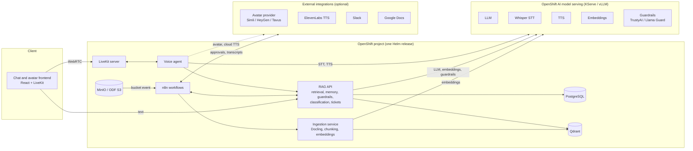

# Deploy an enterprise voice and avatar assistant on OpenShift AI

Ground a voice-enabled, avatar-fronted assistant in your company documents with RAG, n8n workflows, and models served on Red Hat OpenShift AI.

> **Status: work in progress.** This README describes the target design. Components are being added incrementally; see [Repository structure](#repository-structure) for what exists today.

## Table of Contents

- [Overview](#overview)
- [Detailed description](#detailed-description)
  - [See it in action](#see-it-in-action)
  - [Architecture diagrams](#architecture-diagrams)
- [Requirements](#requirements)
  - [Minimum hardware requirements](#minimum-hardware-requirements)
  - [Minimum software requirements](#minimum-software-requirements)
  - [Required user permissions](#required-user-permissions)
- [Deploy](#deploy)
  - [Prerequisites](#prerequisites)
  - [Installation](#installation)
  - [Validating the deployment](#validating-the-deployment)
  - [Delete](#delete)
- [Demo walkthrough](#demo-walkthrough)
- [Repository structure](#repository-structure)
- [References](#references)
- [Technical details](#technical-details)
- [Tags](#tags)

## Overview

Employees lose time hunting through policies, contracts, and internal procedures, and service desks spend hours on requests that follow a predictable intake, approval, and fulfillment pattern. This quickstart deploys an enterprise virtual assistant that answers questions from your own documents with citations, talks back through a lip-synced avatar, remembers the conversation, classifies incoming documents, and turns spoken requests into tracked tickets with Slack approval.

It is built for platform and AI teams who want a sovereign, self-hosted assistant. Every model (LLM, speech-to-text, text-to-speech, embeddings) runs on Red Hat OpenShift AI, data stays in PostgreSQL and Qdrant on your cluster, and the orchestration lives in n8n workflows you can inspect and change. After deploying, you can upload documents, ask questions by text or voice, drop in an invoice for field extraction, and file a service request end to end.

## Detailed description

Knowledge in most organizations is scattered across PDFs, Word documents, wikis, and ticketing systems. Chat assistants built on public APIs can answer questions, but they send sensitive content off-platform, cannot show where an answer came from, and rarely close the loop on the actions that follow a question, such as approving a request or updating a ticket. Voice and avatar interfaces make assistants approachable for frontline staff, kiosks, and accessibility use cases, but they add real-time speech pipelines that are hard to run privately.

This quickstart addresses that gap with a complete, self-hosted stack. Documents dropped into object storage are parsed with Docling, chunked, embedded, and indexed in Qdrant. A RAG service retrieves relevant passages, applies input and output guardrails, and asks an LLM served on OpenShift AI for a grounded answer with source and page citations. Conversation history and long-term memory are persisted in PostgreSQL so follow-up questions work across text and voice. A LiveKit-based voice agent streams microphone audio through Whisper, the same RAG service, and a TTS model, and drives a pluggable avatar provider for lip-synced video. Users can interrupt the avatar mid-sentence.

Beyond question answering, the assistant handles two workflow patterns common to every enterprise. Incoming documents such as invoices and contracts are classified and their fields extracted to JSON, then routed to Slack or downstream systems. Service requests submitted by chat, voice, or form are classified, sent to Slack for approval, fulfilled, and tracked as tickets in PostgreSQL, with the avatar confirming the outcome. Transcripts are archived to Google Docs and re-ingested so the assistant learns from its own conversations. Typical scenarios include IT and HR help desks, procurement intake, and front-desk or kiosk assistants in regulated industries where data must not leave the organization.

### See it in action

Demo links will be added once the stack has been validated on a cluster.

- Interactive demo (Arcade): coming soon
- Video walkthrough: coming soon

### Architecture diagrams


<details>
<summary>Diagram source (Mermaid)</summary>



</details>

How data moves through the system:

1. **Ingestion.** Documents land in an S3 bucket (MinIO or OpenShift Data Foundation) or Google Drive. A bucket notification triggers the n8n ingestion workflow, which calls the ingestion service. Docling parses the file, chunks are embedded with the embeddings model, and vectors with source and page metadata are upserted into Qdrant.
2. **Text question.** The frontend calls the RAG API. The API checks input guardrails, retrieves the top chunks from Qdrant, loads recent history from PostgreSQL, calls the LLM, checks output guardrails, stores the exchange, and returns an answer with citations.
3. **Voice question.** The browser connects over WebRTC to the LiveKit server. The voice agent transcribes speech with Whisper, calls the same RAG API, synthesizes the reply with the TTS model, and hands audio to the avatar provider, which publishes lip-synced video back into the room.
4. **Workflows.** Classification, request intake, Slack approvals, and transcript archival run as n8n workflows that call the RAG API and the Slack and Google Docs integrations.

## Requirements

### Minimum hardware requirements

Application components, per replica, using the chart defaults:

| Component | CPU request / limit | Memory request / limit | Storage |
|---|---|---|---|
| Frontend | 100m / 500m | 128 MiB / 256 MiB | none |
| RAG API | 500m / 2 vCPU | 1 GiB / 2 GiB | none |
| Ingestion service | 1 vCPU / 4 vCPU | 2 GiB / 8 GiB | none |
| Voice agent | 500m / 2 vCPU | 1 GiB / 2 GiB | none |
| LiveKit server | 500m / 2 vCPU | 512 MiB / 2 GiB | none |
| n8n | 250m / 1 vCPU | 512 MiB / 1 GiB | 8 GiB PVC |
| PostgreSQL | 250m / 1 vCPU | 512 MiB / 1 GiB | 10 GiB PVC |
| Qdrant | 250m / 1 vCPU | 512 MiB / 2 GiB | 10 GiB PVC |
| MinIO | 250m / 1 vCPU | 512 MiB / 1 GiB | 20 GiB PVC |

Models served on OpenShift AI, only if you deploy them with the chart instead of pointing at existing endpoints:

| Model | Example | GPU | CPU / Memory |
|---|---|---|---|
| LLM | Llama 3.1 8B Instruct on vLLM | 1 NVIDIA GPU with 24 GiB or more (L4, A10G, L40S, A100) | 4 vCPU / 16 GiB |
| Speech-to-text | Whisper large-v3-turbo on vLLM | 1 NVIDIA GPU with 16 GiB or more, or shared with the LLM | 2 vCPU / 8 GiB |
| Text-to-speech | Kokoro or Orpheus | Optional. CPU is sufficient for demo load | 2 vCPU / 4 GiB |
| Embeddings | BGE-M3 or nomic-embed on vLLM | Optional. CPU is sufficient for demo load | 2 vCPU / 8 GiB |
| Guardrails | Llama Guard 3 8B on vLLM | 1 NVIDIA GPU with 16 GiB or more | 4 vCPU / 16 GiB |

> **Note:** If all models come from Models-as-a-Service (MaaS) endpoints, no GPU is required in the cluster.

### Minimum software requirements

- Red Hat OpenShift 4.16 or later
- Red Hat OpenShift AI 2.16 or later with KServe single-model serving and the vLLM ServingRuntime enabled
- NVIDIA GPU Operator and Node Feature Discovery Operator, only if deploying GPU models with the chart
- A default StorageClass that supports ReadWriteOnce volumes
- Client tools: `oc` 4.16 or later and `helm` 3.14 or later
- Optional: Terraform 1.6 or later for the automated install path
- Optional external services: a Slack workspace with a bot token, a Google Cloud project with the Docs and Drive APIs enabled, an avatar provider account (Simli, HeyGen, or Tavus), and ElevenLabs

Tested version combinations will be recorded here once validation runs complete.

### Required user permissions

This quickstart deploys as a regular OpenShift user with:

- Permission to create a project, or an existing project where you are an admin
- Permission to create Deployments, StatefulSets, Services, Routes, PersistentVolumeClaims, Secrets, and ConfigMaps in that project
- Permission to create InferenceServices and ServingRuntimes in that project, only if deploying models with the chart

No cluster admin access is required. Two caveats:

- PostgreSQL, Qdrant, MinIO, and n8n are deployed by the chart itself rather than by cluster-wide operators, so no operator installation is needed.
- The LiveKit server must expose WebRTC media to browsers. The default configuration uses TCP through a Route. Exposing UDP for better audio quality requires a LoadBalancer Service, which some clusters restrict to admins.

## Deploy

### Prerequisites

Before deploying, ensure you have:

- Access to an OpenShift cluster with OpenShift AI installed that meets the requirements above
- `oc` installed and logged in (`oc whoami` returns your user)
- `helm` installed
- Model endpoints ready: either existing OpenAI-compatible endpoints (MaaS) with API keys, or GPU capacity to deploy models with the chart
- Optional: a Slack bot token, a Google service account JSON key, an avatar provider API key, and an ElevenLabs API key

### Installation

1. Clone the repository:

```bash
git clone https://github.com/rh-ai-quickstart/enterprise-voice-avatar-assistant.git
cd enterprise-voice-avatar-assistant
```

2. Create a new OpenShift project:

```bash
PROJECT="voice-avatar-assistant"
oc new-project ${PROJECT}
```

3. Fetch the chart dependencies (Qdrant, n8n, MinIO, LiveKit):

```bash
helm dependency update deploy/helm
```

4. Install the chart. Pick one of the two model options.

**Option A: bring your own model endpoints (MaaS)**

Point each model at an existing OpenAI-compatible endpoint. Endpoints must include the protocol and the `/v1` path.

```bash
helm install assistant deploy/helm --namespace ${PROJECT} \
  --set models.llm.endpoint=https://LLM_ENDPOINT/v1 \
  --set models.llm.name=LLM_MODEL_NAME \
  --set models.llm.apiKey=LLM_API_KEY \
  --set models.stt.endpoint=https://STT_ENDPOINT/v1 \
  --set models.stt.name=STT_MODEL_NAME \
  --set models.stt.apiKey=STT_API_KEY \
  --set models.tts.endpoint=https://TTS_ENDPOINT/v1 \
  --set models.tts.name=TTS_MODEL_NAME \
  --set models.tts.apiKey=TTS_API_KEY \
  --set models.embeddings.endpoint=https://EMBEDDINGS_ENDPOINT/v1 \
  --set models.embeddings.name=EMBEDDINGS_MODEL_NAME \
  --set models.embeddings.apiKey=EMBEDDINGS_API_KEY
```

**Option B: deploy the models with the chart**

The chart creates InferenceServices for the LLM, Whisper, TTS, and embeddings models on OpenShift AI. This requires GPUs; see [Minimum hardware requirements](#minimum-hardware-requirements).

```bash
helm install assistant deploy/helm --namespace ${PROJECT} \
  --set models.llm.deploy=true \
  --set models.stt.deploy=true \
  --set models.tts.deploy=true \
  --set models.embeddings.deploy=true
```

The two options can be mixed per model, for example a MaaS LLM with Whisper deployed locally. For longer configurations, copy `deploy/helm/values.yaml`, edit it, and pass it with `-f my-values.yaml`. Slack, Google Docs, the avatar provider, ElevenLabs, and guardrails are configured through the same values file.

5. Import the n8n workflows. Open the n8n Route, sign in, import each JSON file from `n8n/workflows/`, and attach your Slack and Google credentials to the corresponding nodes.

```bash
echo https://$(oc get route/n8n -n ${PROJECT} --template='{{.spec.host}}')
```

#### Testing model access before deploying

If you are bringing your own LLM endpoint (Option A), verify it is reachable from the cluster before installing:

```bash
oc run test-model-access --rm -it --restart=Never \
  --image=registry.access.redhat.com/ubi9/ubi-minimal:latest \
  -- /bin/sh -c 'curl -sf --max-time 10 \
    -H "Authorization: Bearer LLM_API_KEY" \
    -H "Content-Type: application/json" \
    -d "{\"model\": \"LLM_MODEL_NAME\", \"messages\": [{\"role\": \"user\", \"content\": \"Say hello in one word.\"}], \"max_tokens\": 10}" \
    "https://LLM_ENDPOINT/v1/chat/completions" && echo "" && echo "SUCCESS" || echo "FAILED"'
```

### Validating the deployment

1. Check that all pods are running. Model pods can take several minutes to download weights on first start.

```bash
oc get pods -n ${PROJECT}
```

2. Get the frontend URL and open it in a browser:

```bash
echo https://$(oc get route/frontend -n ${PROJECT} --template='{{.spec.host}}')
```

3. Run the Helm tests. They verify that the LLM endpoint responds and that the RAG API and ingestion service report healthy.

```bash
helm test assistant --namespace ${PROJECT}
```

4. Upload a sample document. Open the MinIO console, sign in with the credentials from the chart values, and upload a file from `data/sample-docs/` to the `documents` bucket. The ingestion workflow in n8n should run within a few seconds.

```bash
echo https://$(oc get route/minio-console -n ${PROJECT} --template='{{.spec.host}}')
```

5. Ask a question about the uploaded document in the frontend. The answer should include citations pointing at the file and page.

### Delete

1. Uninstall the Helm release:

```bash
helm uninstall assistant --namespace ${PROJECT}
```

2. Remove the persistent volumes. Helm keeps them by default so data survives upgrades.

```bash
oc delete pvc -l app.kubernetes.io/instance=assistant -n ${PROJECT}
```

3. (Optional) Delete the project:

```bash
oc delete project ${PROJECT}
```

## Demo walkthrough

The demo follows one storyline, from deployment to portability. Each step builds on the previous one.

1. **Deploy the full stack** with a single `helm install` (or `terraform apply`), then show the pods, Routes, and InferenceServices coming up.
2. **Upload company documents** to the MinIO bucket and watch the ingestion workflow run in n8n: parse, chunk, embed, index, notify.
3. **Ask a question in text.** The answer is grounded in the uploaded documents and the citations panel shows the source file and page.
4. **Ask the same question by voice.** The avatar answers with lip-synced speech. Interrupt it mid-sentence to show barge-in.
5. **Ask a follow-up question** that only makes sense with context. The assistant uses conversation memory from PostgreSQL to resolve it.
6. **Drop an invoice or contract** into the bucket. The classification workflow identifies the document type, extracts fields to JSON, and posts the result to Slack.
7. **Submit a service request by voice.** A ticket is created in PostgreSQL, an approval request appears in Slack, and after approval the avatar confirms fulfillment.
8. **Show the transcript** saved to Google Docs and re-ingested, then ask a question that the transcript answers.
9. **Open the OpenShift AI dashboard** to show the served models and their metrics, then the Qdrant and PostgreSQL data behind the demo.
10. **Swap the avatar provider or the LLM endpoint** with a values change and redeploy, demonstrating portability and data sovereignty.

## Repository structure

Target layout. Directories marked *planned* are not in the repository yet.

```
.
├── README.md
├── LICENSE
├── docs/
│   └── images/               # Architecture diagram and screenshots
├── deploy/
│   ├── helm/                 # planned: umbrella chart for frontend, RAG API, ingestion, voice agent,
│   │                         #   PostgreSQL, Qdrant, MinIO, n8n, LiveKit, optional model InferenceServices
│   └── terraform/            # planned: namespace and Helm release automation
├── n8n/workflows/            # planned: exported workflow JSON (chat, ingestion, classification,
│                             #   request intake and approval, transcript archival)
├── frontend/                 # planned: React + LiveKit chat and avatar UI
├── services/
│   ├── rag-api/              # planned: retrieval, memory, guardrails, classification, tickets (FastAPI)
│   ├── ingestion/            # planned: Docling parsing, chunking, embeddings, Qdrant upsert (FastAPI)
│   └── voice-agent/          # planned: LiveKit Agents worker (STT, RAG API, TTS, avatar)
├── data/sample-docs/         # planned: sample policies, invoices, and contracts for the demo
└── .github/workflows/        # planned: CI for helm lint, tests, and container builds
```

Today the repository contains this README, the LICENSE placeholder, `docs/images/`, and the quickstart template chart under `chart/`. The template chart will move to `deploy/helm/` and become the umbrella chart.

## References

- [Red Hat OpenShift AI documentation](https://docs.redhat.com/en/documentation/red_hat_openshift_ai_self-managed)
- [Serving models with vLLM on OpenShift AI](https://docs.redhat.com/en/documentation/red_hat_openshift_ai_self-managed/latest/html/serving_models/)
- [Docling](https://docling-project.github.io/docling/)
- [Qdrant](https://qdrant.tech/documentation/)
- [n8n](https://docs.n8n.io/)
- [LiveKit Agents](https://docs.livekit.io/agents/)
- [TrustyAI Guardrails](https://trustyai.org/docs/main/guardrails)
- [Llama Guard](https://www.llama.com/docs/model-cards-and-prompt-formats/llama-guard-3/)
- Related quickstarts: [basic-speech-to-text-with-whisper](https://github.com/rh-ai-quickstart/basic-speech-to-text-with-whisper), [RAG](https://github.com/rh-ai-quickstart/RAG), [guardrailing-llms](https://github.com/rh-ai-quickstart/guardrailing-llms), [it-self-service-agent](https://github.com/rh-ai-quickstart/it-self-service-agent)

## Technical details

**Model endpoints.** Every model is consumed through an OpenAI-compatible API: chat completions for the LLM and guardrails, audio transcriptions for Whisper, audio speech for TTS, and embeddings for the indexing model. Each model has three values (`endpoint`, `name`, `apiKey`) and a `deploy` toggle. Switching from a local InferenceService to a MaaS endpoint, or to a frontier provider as a fallback, is a values change with no code change.

**RAG API.** A FastAPI service that owns retrieval, memory, guardrails, classification, and tickets so that text chat, voice, and n8n all share one grounded answer path. Main endpoints: `POST /v1/chat` (grounded answer with citations and memory), `POST /v1/search` (retrieval only), `POST /v1/classify` (document type and field extraction to JSON), `POST /v1/tickets` and `PATCH /v1/tickets/{id}` (service request state), `GET /v1/voice/token` (LiveKit room token for the browser).

**Ingestion.** Docling converts PDF, DOCX, PPTX, HTML, and images to a structured document. The hybrid chunker produces token-bounded chunks with heading context. Each Qdrant point carries `doc_id`, `source`, `page`, `chunk_index`, and `text`, which is what the citations panel displays. Re-ingesting a document with the same `doc_id` replaces its points.

**Memory and tickets.** PostgreSQL holds `conversations`, `messages` (with citations as JSONB), `user_memory` for long-lived facts, `documents` for classification results, and `tickets` for the request workflow. n8n uses the same database under its own schema.

**Voice.** The voice agent is a LiveKit Agents worker. Silero VAD detects turns and enables interruption, Whisper transcribes, the RAG API produces the answer, and the TTS model synthesizes it. When an avatar provider is configured, the agent hands its audio to the provider, which publishes synchronized video into the room. With no provider configured, the agent publishes audio only.

**Avatar providers.** The provider is selected by a single value. Simli, HeyGen, and Tavus are supported through their LiveKit plugins. An open-source option based on Ready Player Me is planned.

**Guardrails.** Input and output checks run in the RAG API with a provider switch: `none`, `llama-guard` (a Llama Guard model served on OpenShift AI), or `trustyai` (the TrustyAI Guardrails orchestrator). Blocked requests return a safe message and are logged.

**Workflows.** The five n8n workflows call the RAG API and ingestion service by their in-cluster service names. Slack and Google Docs credentials are added in the n8n UI after import, not stored in the chart.

**Naming.** Application services use fixed names (`frontend`, `rag-api`, `ingestion`, `voice-agent`, `postgres`, `qdrant`, `minio`, `n8n`, `livekit`) so that workflows and configuration are stable regardless of the Helm release name. Deploy one release per project.

## Tags

- **Title:** Deploy an enterprise voice and avatar assistant on OpenShift AI
- **Description:** Ground a voice-enabled, avatar-fronted assistant in your company documents with RAG, n8n workflows, and models served on Red Hat OpenShift AI.
- **Industry:** Media and IT services
- **Product:** Red Hat OpenShift AI
- **Use case:** Productivity, automation
- **Partner:** N/A
- **Contributor org:** Red Hat
